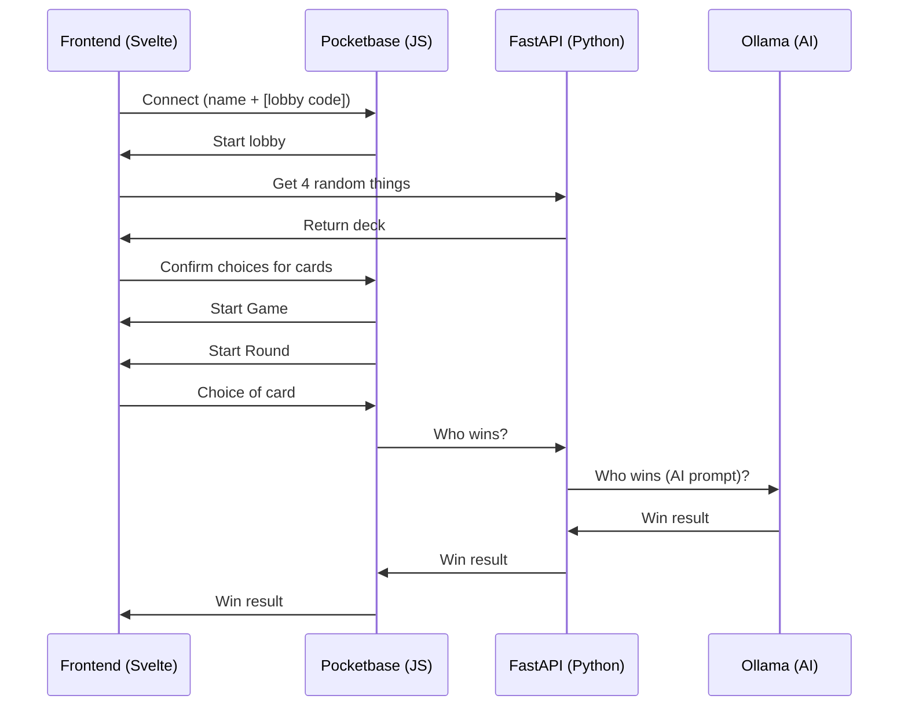

# WHACK 26

```mermaid
sequenceDiagram
    participant A as Frontend (Svelte)
    participant B as Pocketbase (JS)
    participant C as FastAPI (Python)
    participant D as Ollama (AI)

    A->>B: Connect (name + [lobby code])

    B->>A: Start lobby
    A->>C: Get 4 random things
    C->>A: Return deck

    A->>B: Confirm choices for cards

    B->>A: Start Game

    B->>A: Start Round

    A->>B: Choice of card

    B->>C: Who wins?
    C->>D: Who wins (AI prompt)?
    D->>C: Win result
    C->>B: Win result
    B->>A: Win result
```

- Frontend (Svelte)
- Backend (Python with fastapi)
- pocketbase (with js extension)

## FastAPI

